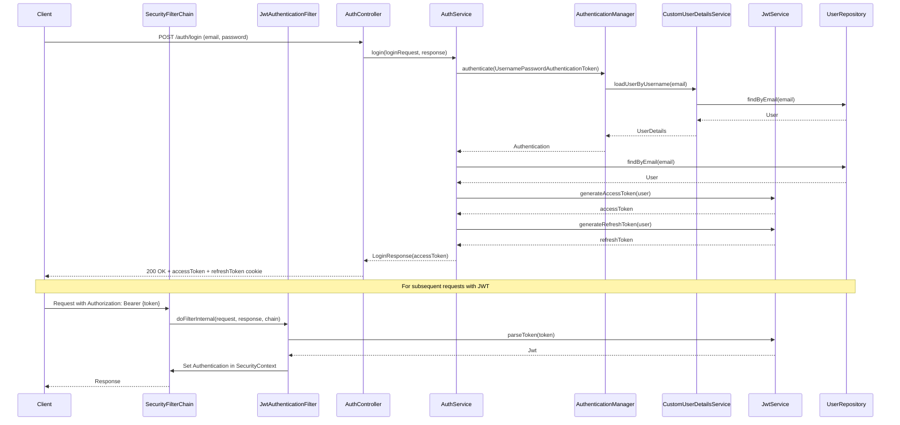
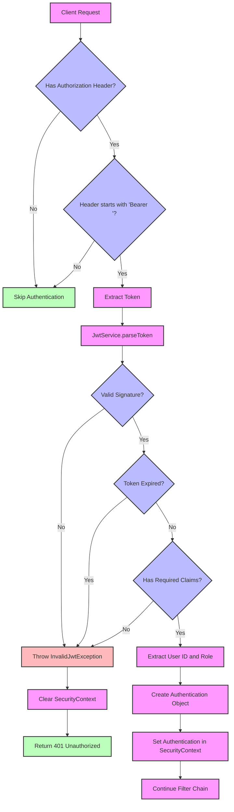
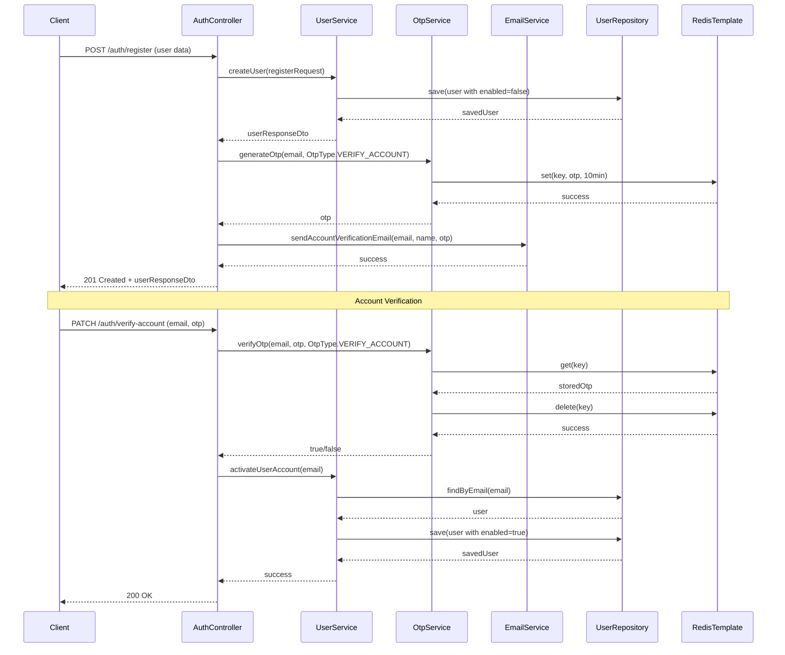
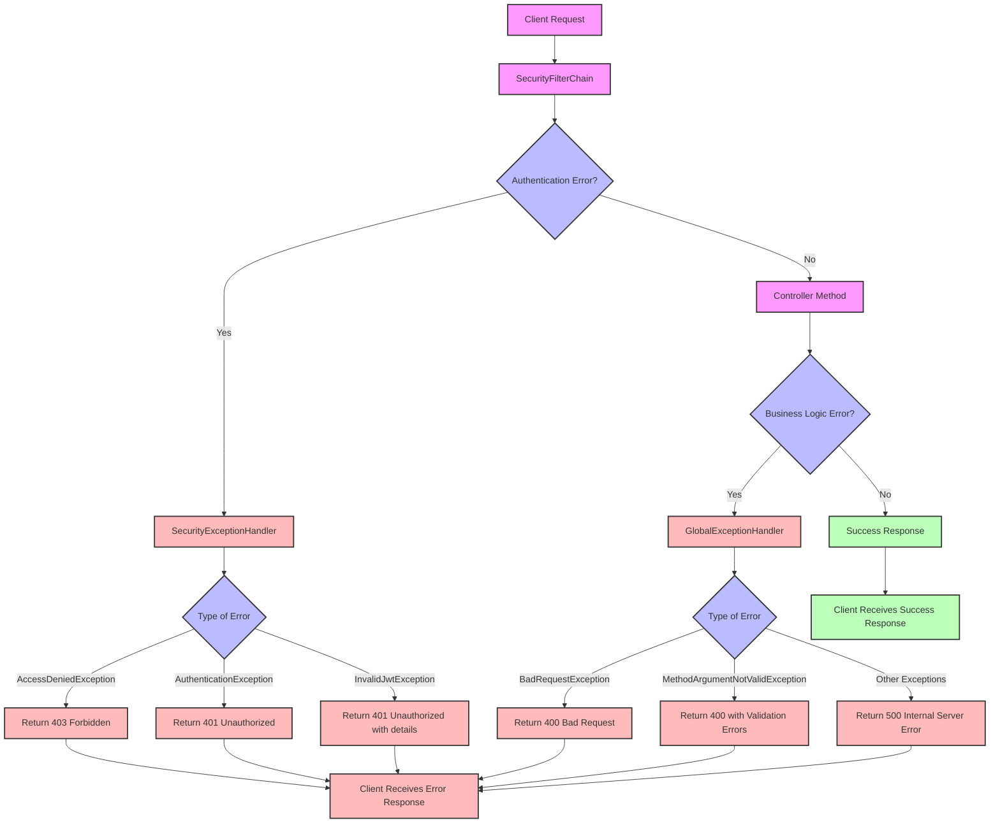
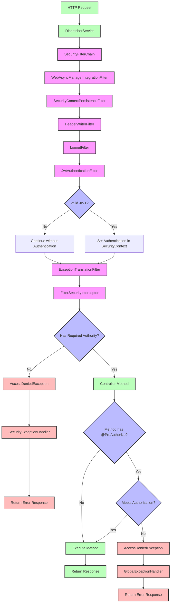

# Security Flow Diagrams

This document provides schematic diagrams illustrating the security flows in the application, focusing on the essential functions from Spring Security filters to controllers and error handling.

## Table of Contents
1. [Authentication Flow](#authentication-flow)
2. [JWT Token Validation Flow](#jwt-token-validation-flow)
3. [User Registration and Verification Flow](#user-registration-and-verification-flow)
4. [Error Handling Flow](#error-handling-flow)

## Authentication Flow

## JWT Token Validation Flow

## User Registration and Verification Flow

## Error Handling Flow

## Function-Level Security Flow

